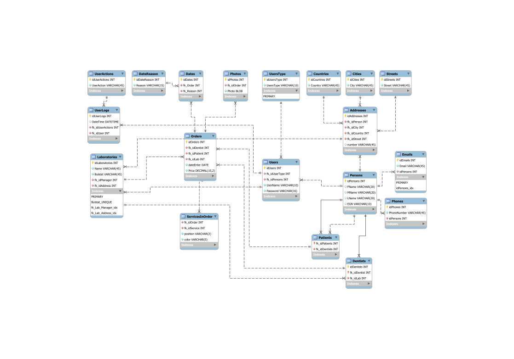

# DENT-INFO
[https://mihov.github.io/dent-info/](https://mihov.github.io/dent-info/)
***
## On Line организиране дейността на зъботехническа лаборатория (ЗЛ).

### Основни обекти:
1. **Зъботехническа лаборатория:**
	1. Име
	2. Булстат
	3. Седалище
	4. Управител - МОЛ
	5. Контакти
	6. Списък със зъболекари, с които работи
	7. Списък с услуги, които предлага.
	8. Списък с поръчки
	9. Списък администратори-Управители
2. **Управител:**
	1. Име
	2. Потребителско име
	3. Парола
	4. Контакти
	5. ЕГН
	6. Права на достъп
3. **Зъболекар:**
	1. Име
	2. Потребителско име
	3. Парола
	4. Булстат
	5. ЕГН
	6. Контакти
	7. Списък с пациенти
	8. Списък с индивидуални цени – ако са договорени
4. **Пациент:**
	1. Име
	2. Потребителско име
	3. Парола
	4. ЕГН
	5. Контакти
5. **Услуга**
	1. Уникален номер
	2. Име
	3. Цена
6. **Поръчка:**
	1. Уникален номер
	2. Списък с услуги по зъбен статус
	3. Пациент
	4. Зъболекар
	5. Дата на приемане на поръчката
	6. Дата на завършване на поръчката (срок)
	7. Цена
	8. Дата за проба
	9. Статус готовност
	10. Статус платена
	11. Снимка
7. **Администратор на системата:**
	1. Име
	2. Потребителско име
	3. Парола
	4. Контакти
	5. Права на достъп

***
## Основни функционалности:
1. **Регистрация**/модификация на управител на ЗЛ.
2. **Логване** на управителя в системата.
	1. Създаване/модификация на ЗЛ.
	2. Създаване/модификация на списъка с предлагани услуги(импорт, експорт).
	3. Създаване/модифициране на индивидуални ценови листи
	4. Създаване/модификация на списъка със зъболекари.
	5. Изпращане на уведомление за извършена регистрация на зъболекар по мейл.
	6. Създаване/модификация на списъка с пациенти към съответния зъболекар.
	7. Създаване/модификация на списъка с поръчки.
	8. Справки
		1. За периоди
		2. Платени
		3. Завършени
		4. По зъболекари
		5. По пациенти
3. **Логване** на зъболекар
	1. Модификация на профила на зъболекаря
	2. Добавяне/модификация на списъка с пациенти.
	3. Изпращане на уведомление за извършена регистрация по мейл
	4. Добавяне на поръчка
	5. Следене състоянието на поръчките
	6. Справки
4. **Логване** на пациент
	1. Модифициране на профила на пациента
	2. Следене състоянието на поръчките
	3. Справки
5. **Системата да уведомява** по мейл за изтичащи срокове, неплатени поръчки, проби…
6. **Нулиране и подновяване на пароли**
7. **Логване** на администратор
	1. Създаване/модифициране на списъка с администратори
	2. Справки по зъботехнически лаборатории

***
## DB Diagram

